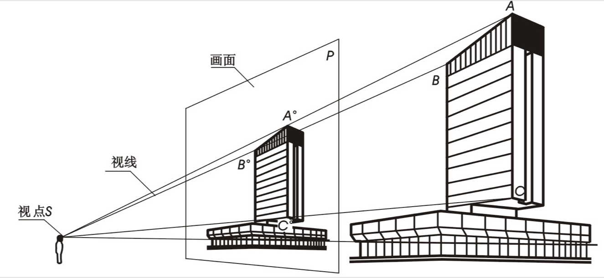
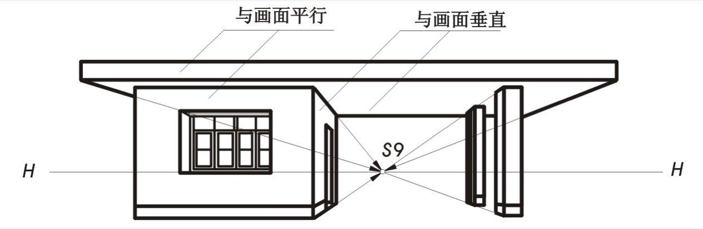
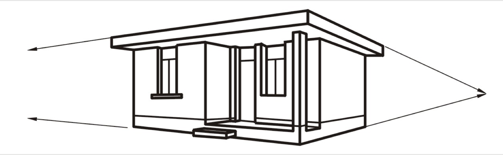
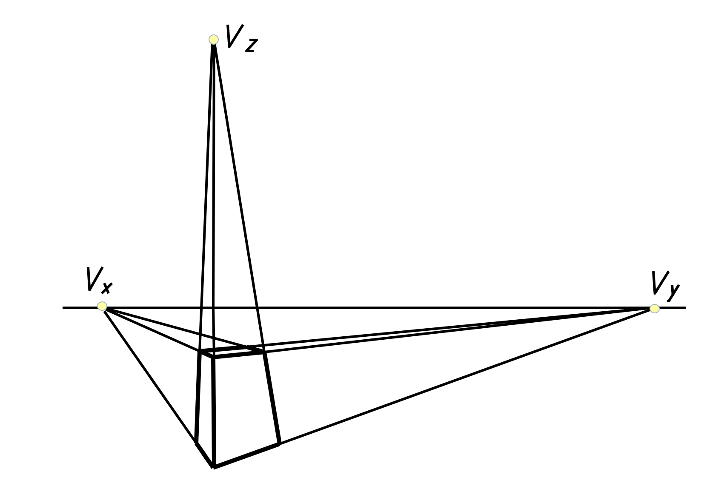
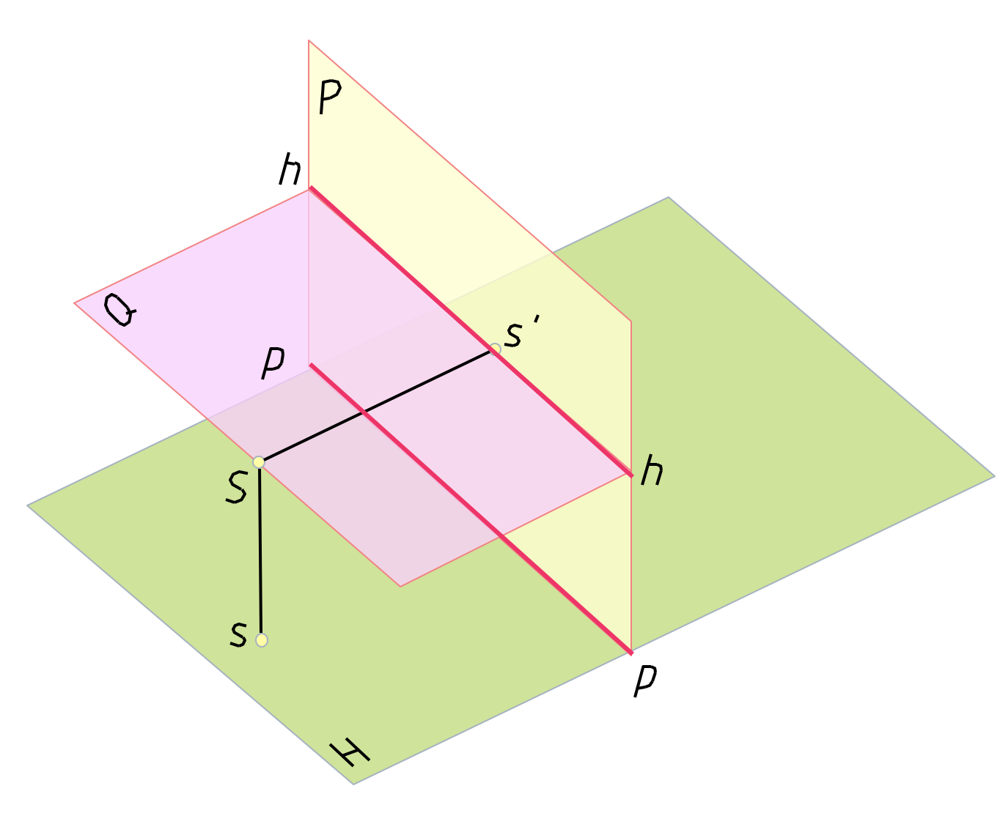
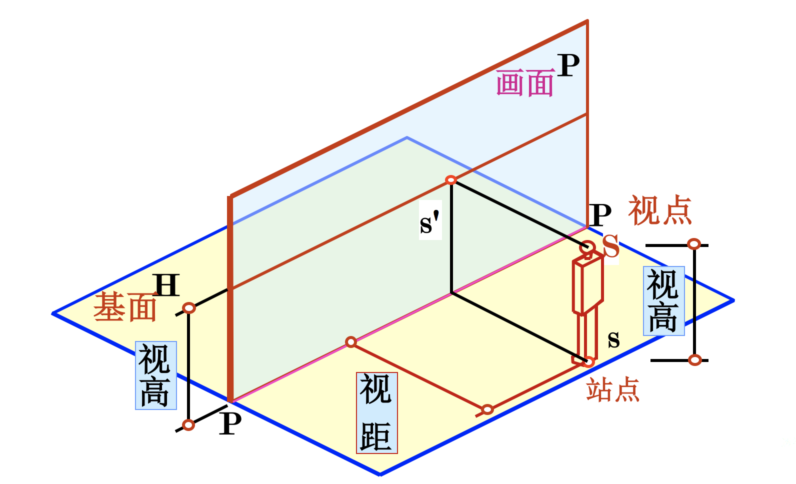

## 透视图简介

当人们站在玻璃窗内用一只眼睛观看室外的建筑物时，无数条视线与玻璃窗相交，把各交点连接起来的图形即为透视图，如下图：

透视图的特点：
近大远小；近高远低；近疏远密；互相平行的直线的透视汇交于一点。

根据物体与画面的不同位置，透视图可分为一点透视、两点透视和三点透视。

### 一点透视

物体上的主要立面(长度和高度方向)与画面平行，宽度方向的直线垂直于画面所作的透视图只有一个灭点，称为一点透视，如下图：

### 两点透视

物体上的主要表面与画面倾斜，但其上的铅垂线与画面平行，所作的透视图有两个灭点，称为两点透视，如下图：

### 三点透视

物体上长、宽、高三个方向与画面均不平行时，所作的透视图有三个灭点，称为三点透视。在这三种透视图中，两点透视应用最多，三点透视因作图复杂，很少采用。 如下图：

###透视图的术语

结合第一张图一起看：基面H，画面P，视点S，基线p-p，视平面Q，视平线h-h，主视线Ss’，主点s’，站点s

基线：基面与画面的交线。 在画面上以 P-P表示基线，在平面图中以 PH-PH表示画面的位置。

视点（S）：人眼所在的位置，即投影中心。

站点（S）：人站立的位置，即视点在基面上正透影。

主点（s'）:视点在画面上的正投影。

视高（Ss）:视点至基面的距离。

视距（Ss'）:视点至画面的距离。

灭点 : 直线上离画面无限远点的透视。

……

